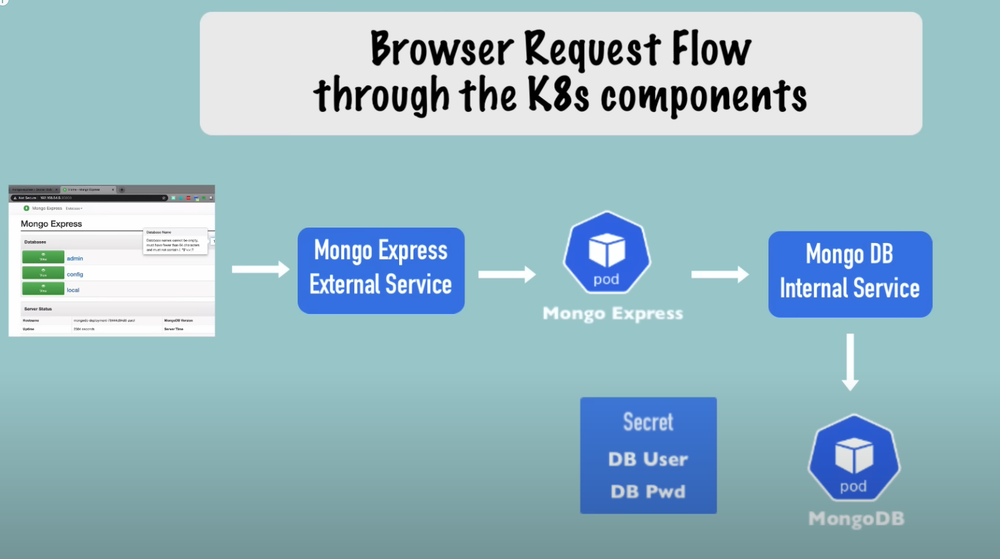
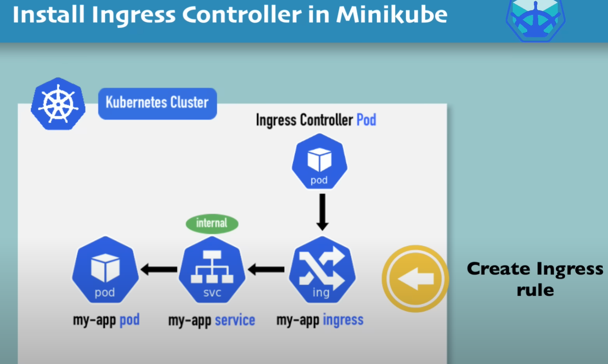

# 5 - Kubernetes Tutorial for Beginners
#Tutorial series from "Techworld with Nana" Youtube channel
[https://www.youtube.com/c/techworld-with-nana](https://www.youtube.com/c/techworld-with-nana)

## Contents

►  Api Server
►  Scheduler
►  Controller Manager
►  etcd - the cluster brain

🔥  Minikube and kubectl - Local Setup 🔥
►  What is minikube?
►  What is kubectl?
►   install minikube and kubectl
►  create and start a minikube cluster

🔗 Links:
Install Minikube (Mac, Linux and Windows): https://bit.ly/38bLcJy 
Install Kubectl: https://bit.ly/32bSI2Z
Gitlab: If you are using Mac, you can follow along the commands. I listed them all here: https://bit.ly/3oZzuHY

🔥  Main Kubectl Commands - K8s CLI 🔥
►  Get status of different components
►  create a pod/deployment
►  layers of abstraction
►  change the pod/deployment
►  debugging pods
►  delete pod/deployment
►  CRUD by applying configuration file

🔗 - Git repo link of all the commands: https://bit.ly/3oZzuHY

🔥  K8s YAML Configuration File 🔥
►  3 parts of a Kubernetes config file (metadata, specification, status)
►  format of configuration file
►  blueprint for pods (template)
►  connecting services to deployments and pods (label & selector & port)
►  demo

🔗 - Git repo link: https://bit.ly/2JBVyIk

🔥 Demo Project 🔥
►  Deploying MongoDB and Mongo Express
►  MongoDB Pod
►  Secret
►  MongoDB Internal Service
►  Deployment Service and Config Map
►  Mongo Express External Service

🔗 - Git repo link: https://bit.ly/3jY6lJp

🔥  Organizing your components with K8s Namespaces 🔥
►  What is a Namespace?
►  4 Default Namespaces
►  Create a Namespace
►  Why to use Namespaces? 4 Use Cases
►  Characteristics of Namespaces
►  Create Components in Namespaces
►  Change Active Namespace

🔗 - Install Kubectx: https://github.com/ahmetb/kubectx#ins...

🔥  K8s Ingress explained 🔥
►  What is Ingress? External Service vs. Ingress
►  Example YAML Config Files for External Service and Ingress
►  Internal Service Configuration for Ingress
►  How to configure Ingress in your cluster?
►  What is Ingress Controller?
►  Environment on which your cluster is running (Cloud provider or bare metal)
►  Demo: Configure Ingress in Minikube
►  Ingress Default Backend
►  Routing Use Cases
►  Configuring TLS Certificate

🔗 Links:
Git Repo: https://bit.ly/3mJHVFc
Ingress Controllers: https://bit.ly/32dfHe3
Ingress Controller Bare Metal: https://bit.ly/3kYdmLB

🔥  Helm - Package Manager 🔥
►  Package Manager and Helm Charts
►  Templating Engine
►  Use Cases for Helm
►  Helm Chart Structure
►  Values injection into template files
►  Release Management / Tiller (Helm Version 2!)

🔗 Links:
Helm hub: https://hub.helm.sh/
Helm charts GitHub Project: https://github.com/helm/charts
Install Helm: https://helm.sh/docs/intro/install/

🔥  Persisting Data in K8s with Volumes 🔥
►  The need for persistent storage & storage requirements
►  Persistent Volume (PV)
►  Local vs Remote Volume Types
►  Who creates the PV and when?
►  Persistent Volume Claim (PVC)
►  Levels of volume abstractions
►  ConfigMap and Secret as volume types
►  Storage Class (SC)

🔗 - Git Repo: https://bit.ly/2Gv3eLi

🔥  Deploying Stateful Apps with StatefulSet 🔥
►  What is StatefulSet? Difference of stateless and stateful applications
►  Deployment of stateful and stateless apps
►  Deployment vs StatefulSet
►  Pod Identity
►  Scaling database applications: Master and Worker Pods
►  Pod state, Pod Identifier
►  2 Pod endpoints

🔥  K8s Services 🔥
►   What is a Service in K8s and when we need it?
►  ClusterIP Services
►  Service Communication
►  Multi-Port Services
►  Headless Services
►  NodePort Services
►  LoadBalancer Services

## My Summary

### Main Kubernetes Components
Definition: Kubernetes manage containerized applications.

Advatages: It has High availability (No downtime), scalability and distater recovery.

Pod: Smallest unit of K8S - It's a container which supposed to run one application. Each pod gets its own IP address every time but name and endpoint stay the same when restart.

Service: Permanent IP address, lifecycle on Pod and service is not connected. Also uses as Load Balance.

Ingress: Service open communication to Internet. It routes traffic into cluster.

ConfigMap: External configuration of your application. Helps in URL changes for example.

Secret: Used to store secret data with base64 encoded data. You can use it with Env variables.

Volume: Data Storage in a local or remote storage which is connect to your DB Pod.

DB handeling: **DB deployment only via StatefulSet** and not Deployment like other services and pods.

### Kubernetes Architecture 

**Worker Node:** A physical or virtual machine that runs your application workloads.
    Each Node contains:
    - **Kubelet** – A small agent that communicates with the Kubernetes control plane and ensures containers are running.
    - **Container Runtime** – Software that runs containers, like Docker or containerd.
    - **Kube-Proxy** – Manages network communication for services.
Nodes are part of a Kubernetes cluster and are controlled by the Master Node (Control Plane), which schedules and orchestrates workloads.

**Master Node (Control Plane):** A physical or virtual machine responsible for managing and orchestrating the Kubernetes cluster.  
    Each Master Node contains:  
    - **API Server** – The central component that exposes the Kubernetes API and processes cluster commands.  
    - **Controller Manager** – Ensures desired cluster state by managing controllers (e.g., node lifecycle, replication).  
    - **Scheduler** – Assigns workloads (Pods) to Worker Nodes based on resource availability.  
    - **etcd** – A distributed key-value store that holds the cluster’s configuration and state. Applications data will not be stored here.

The Master Node oversees the entire cluster, ensuring workloads run as expected and maintaining overall system health.

### 2 Demo kubernetes components

Browser Request Flow through K8s Components

### Kubernetes Commands for MongoDB setup

#### kubectl apply commands in order
    
    kubectl apply -f mongo-secret.yaml
    kubectl apply -f mongo.yaml
    kubectl apply -f mongo-configmap.yaml 
    kubectl apply -f mongo-express.yaml

#### kubectl get commands

    kubectl get pod
    kubectl get pod --watch
    kubectl get pod -o wide
    kubectl get service
    kubectl get secret
    kubectl get all | grep mongodb

#### kubectl debugging commands

    kubectl describe pod mongodb-deployment-xxxxxx
    kubectl describe service mongodb-service
    kubectl logs mongo-express-xxxxxx

#### give a URL to external service in minikube

    minikube service mongo-express-service

#### Kubens
A tool to organize namespaces in K8s.

### 3 - Kubernetes-Ingress

` minikube addons enable ingress ` - install Ingress controller on minikube.
` kubectl get pod -n kube-system ` - Show the pods where nginx-ingress-controller pod will be listed.
` kuebctl get ns ` - get namespaces right now it's not accecible externally, but do have internal service and Pod exists.
` kubectl get all -n kubernestes-dashboard ` - pod and service of _kubernetes-dashboard_ will be listed.
` kuebctl apply -f dashboard-ingress.yaml `- Create Ingress Rule. ServiceName, ServicePort and host is already seen in above service and pod, and written in yaml file manually.
` kubectl get ingress -n kubernetes-dashboard` - See the ingress after creation ,it could take a while because it waits to get IP address for the hostname.
` sudo vim /etc/hosts ` - add the line of the IP adress with the host name.

### 4 - Kubernetes Volumes
Three types of Volume:

1) Persistent Volume - Uses pyhiscal storages or cloued storage like NFS storage (files) in spec section.
ConfigMap and Secret Components can be mounted into Pod/Container like Volumes.

2) Persistent Volume Claim - Gives ability to claim available Persistent Volume for pods, Pod will ask via claimName to get some Volume. If the Claim found a Persistent Volume then it will be mounted to the container(s) inside the pod(s).

3) Storage Class - Provisions Persistent Volumes Dynamically when Persistent Volume Claim claims it.

Rules for Storage:

1. Storage Doesn't depeneds on pod lifecycle.

2. Storage must be available on all nodes.

3. Storage needs to survive even if cluster crashes.

Flow of getting storage:

1) Pod claims storage via Persistent Volume Claim.

2) Persistent Volume Claim request storage from Storage Class.

3) Storage Class creates Persistent Volume that meets the needs of the Claim.

### Basic Kubectl Commands

#### install hyperhit and minikube
`brew update`

`brew install hyperkit`

`brew install minikube`

`kubectl`

`minikube`

#### create minikube cluster
`minikube start --vm-driver=hyperkit`

`kubectl get nodes`

`minikube status`

`kubectl version`

#### delete cluster and restart in debug mode
`minikube delete`

`minikube start --vm-driver=hyperkit --v=7 --alsologtostderr`

`minikube status`

#### kubectl commands
`kubectl get nodes`

`kubectl get pod`

`kubectl get services`

`kubectl create deployment nginx-depl --image=nginx`

`kubectl get deployment`

`kubectl get replicaset`

`kubectl edit deployment nginx-depl`

#### debugging
`kubectl logs {pod-name}`

`kubectl exec -it {pod-name} -- bin/bash`

#### create mongo deployment
`kubectl create deployment mongo-depl --image=mongo`

`kubectl logs mongo-depl-{pod-name}`

`kubectl describe pod mongo-depl-{pod-name}`

#### delete deployment
`kubectl delete deployment mongo-depl`

`kubectl delete deployment nginx-depl`

#### create or edit config file
`vim nginx-deployment.yaml`

`kubectl apply -f nginx-deployment.yaml`

`kubectl get pod`

`kubectl get deployment`

#### delete with config
`kubectl delete -f nginx-deployment.yaml`

#### Metrics

`kubectl top` The kubectl top command returns current CPU and memory usage for a cluster’s pods or nodes, or for a particular pod or node if specified.

### Links for the GitHub Actions video

List of GitHub Actions:
* https://github.com/actions
* https://github.com/marketplace?type=actions

Events:
* https://docs.github.com/en/free-pro-team@latest/actions/reference/events-that-trigger-workflows

Docker action we use in the tutorial:
* https://github.com/marketplace/actions/docker-build-push